# Data Flow — function-by-function trace

This document traces **every request type end-to-end**, naming every function involved and every branch it can take. It complements [`README.md`](README.md) (what the system is) and [`docs/architecture.md`](docs/architecture.md) (narrative overview) with the literal call chain: what calls what, in what order, and under which condition.

Notation: `file.py:function` is the exact symbol; `─▶` is a direct call; branch diamonds in the diagrams are real `if`/`try` branches in the code (referenced by file:line).

## Contents

1. [App startup](#1-app-startup)
2. [Request entry — middleware chain (every request)](#2-request-entry--middleware-chain-every-request)
3. [Authentication & token lifecycle](#3-authentication--token-lifecycle)
   - [3.1 Register](#31-register)
   - [3.2 Login](#32-login)
   - [3.3 Create / list / rename / delete session](#33-create--list--rename--delete-session)
   - [3.4 Token verification (every authenticated request)](#34-token-verification-every-authenticated-request)
   - [3.5 JWT internals — exactly how a token is created and checked](#35-jwt-internals--exactly-how-a-token-is-created-and-checked)
4. [Chat turn — `POST /chatbot/chat`](#4-chat-turn--post-chatbotchat)
5. [Streaming chat turn — `POST /chatbot/chat/stream`](#5-streaming-chat-turn--post-chatbotchatstream)
6. [The chat ⇄ tool_call graph loop, in detail](#6-the-chat--tool_call-graph-loop-in-detail)
7. [LLM call: retry + circular fallback](#7-llm-call-retry--circular-fallback)
8. [Tool execution branches](#8-tool-execution-branches)
9. [Acumatica session-cookie lifecycle](#9-acumatica-session-cookie-lifecycle)
10. [Long-term memory read/write](#10-long-term-memory-readwrite)
11. [Fetch / clear history](#11-fetch--clear-history)
12. [Function index (file:line)](#12-function-index-fileline)

---

## 1. App startup

`app/main.py` runs at import time, then `lifespan()` runs once when Uvicorn boots the app.

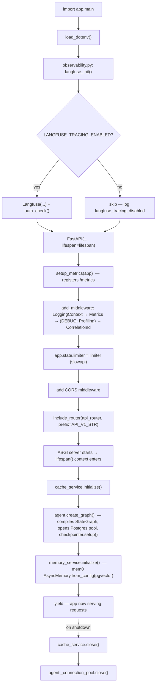

Each of `cache_service.initialize`, `agent.create_graph`, `memory_service.initialize` is wrapped in its own `try/except` in `main.py:lifespan` (`app/main.py:37-51`) — a failure in one does **not** block the others from attempting to start.

---

## 2. Request entry — middleware chain (every request)

Every HTTP request, regardless of route, passes through this fixed chain before reaching a route handler (order = order of `app.add_middleware` calls in `app/main.py:69-96`; Starlette runs them outermost-last-added, so the effective order below is outer→inner):

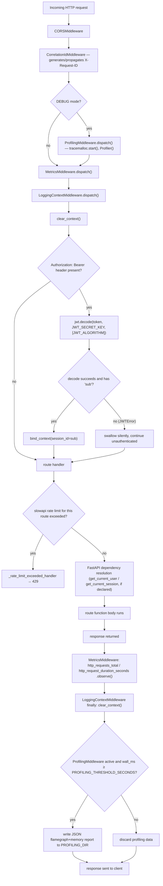

Note the important subtlety at step J/J2: `LoggingContextMiddleware` (`app/core/middleware.py:54-74`) decodes the JWT **only to bind `session_id` into log context** — it does not reject requests with bad/missing tokens. Actual authorization/rejection happens later, inside the `get_current_user`/`get_current_session` FastAPI dependencies (step N), which is where a 401/404/422 would actually be raised.

---

## 3. Authentication & token lifecycle

### 3.1 Register

`POST /api/v1/auth/register` → `app/api/v1/auth.py:register_user`

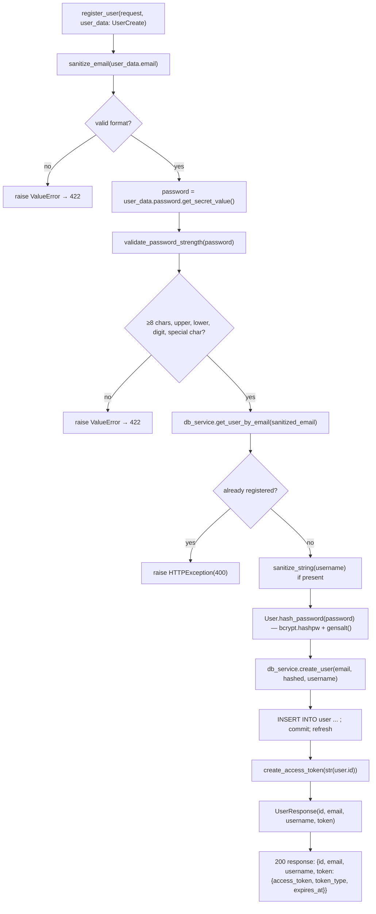

### 3.2 Login

`POST /api/v1/auth/login` (form-encoded) → `app/api/v1/auth.py:login`

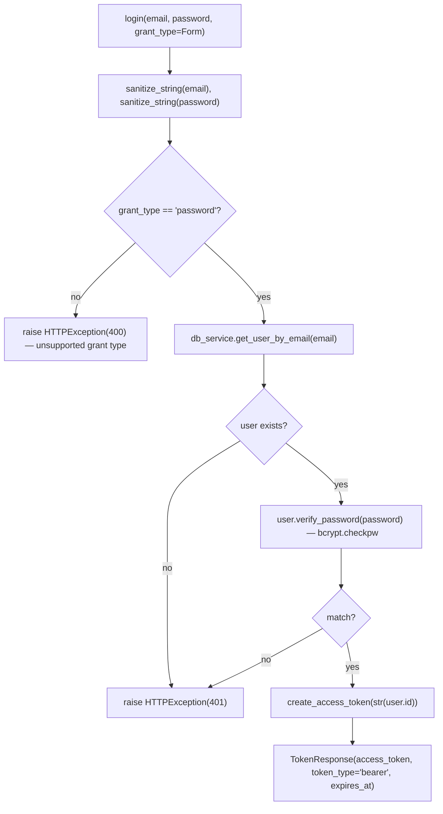

### 3.3 Create / list / rename / delete session

All four require a resolved `User` or `Session` from the dependencies in §3.4.

```mermaid
flowchart TD
    subgraph create["POST /auth/session  (needs get_current_user)"]
        A1["create_session(user)"] --> A2["session_id = str(uuid.uuid4())"]
        A2 --> A3["db_service.create_session(session_id, user.id, username=user.username)"]
        A3 --> A4["create_access_token(session_id)  — sub = session_id"]
        A4 --> A5["SessionResponse(session_id, name, token)"]
    end
    subgraph list["GET /auth/sessions  (needs get_current_user)"]
        B1["get_user_sessions(user)"] --> B2["db_service.get_user_sessions(user.id)"]
        B2 --> B3["for each session: create_access_token(session.id) — re-minted, not stored"]
    end
    subgraph rename["PATCH /auth/session/{id}/name  (needs get_current_session)"]
        C1["update_session_name(session_id, name, current_session)"] --> C2{"session_id == current_session.id?"}
        C2 -- no --> C3["403 Cannot modify other sessions"]
        C2 -- yes --> C4["db_service.update_session_name(...)"]
        C4 --> C5["create_access_token(session_id)  — new token returned"]
    end
    subgraph del["DELETE /auth/session/{id}  (needs get_current_session)"]
        D1["delete_session(session_id, current_session)"] --> D2{"session_id == current_session.id?"}
        D2 -- no --> D3["403 Cannot delete other sessions"]
        D2 -- yes --> D4["db_service.delete_session(sanitized_session_id)"]
    end
```

Every session token is **re-minted on demand** (list/rename both call `create_access_token` again) rather than being persisted anywhere — the JWT itself is the only place a session token "lives"; the server holds no session-token blacklist or store.

### 3.4 Token verification (every authenticated request)

Two FastAPI dependencies, both in `app/api/v1/auth.py`, both built on the same `verify_token`:

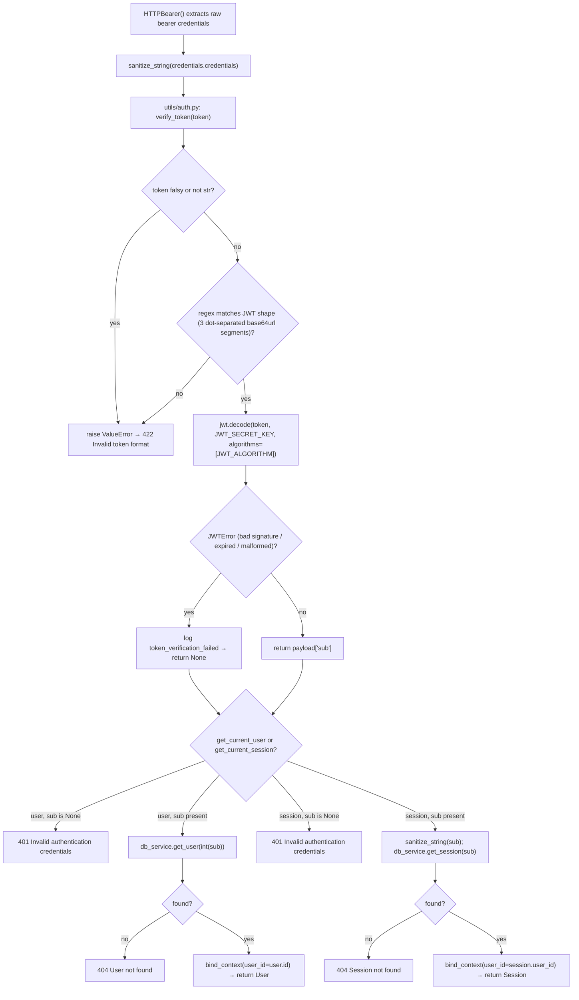

`get_current_user` and `get_current_session` are structurally identical — they differ only in whether the `sub` claim is looked up against the `user` table (`db_service.get_user`) or the `session` table (`db_service.get_session`). This is also *why* a user token cannot be used on a chat endpoint and vice versa: the `sub` value simply won't resolve in the other table.

### 3.5 JWT internals — exactly how a token is created and checked

Both directions live entirely in `app/utils/auth.py` (21 lines of actual logic):

**Creation — `create_access_token(thread_id, expires_delta=None)`**
```python
expire = datetime.now(UTC) + (expires_delta or timedelta(days=settings.JWT_ACCESS_TOKEN_EXPIRE_DAYS))
to_encode = {
    "sub": thread_id,                                              # user id (as str) OR session UUID (as str)
    "exp": expire,                                                 # standard JWT expiry claim
    "iat": datetime.now(UTC),                                      # issued-at
    "jti": sanitize_string(f"{thread_id}-{datetime.now(UTC).timestamp()}"),  # unique-ish token id, not tracked server-side
}
encoded = jwt.encode(to_encode, settings.JWT_SECRET_KEY, algorithm=settings.JWT_ALGORITHM)  # HS256 by default
```
`thread_id` is the **only** thing that differs between a "user token" and a "session token" — the function itself has no concept of token type. `create_access_token` is called from exactly 5 places: `register_user`, `login`, `create_session`, `update_session_name`, `get_user_sessions` (one per list item).

**Verification — `verify_token(token) -> Optional[str]`**
```python
if not token or not isinstance(token, str):
    raise ValueError(...)
if not re.match(r"^[A-Za-z0-9-_]+\.[A-Za-z0-9-_]+\.[A-Za-z0-9-_]+$", token):
    raise ValueError(...)               # structural check before ever touching jose
try:
    payload = jwt.decode(token, settings.JWT_SECRET_KEY, algorithms=[settings.JWT_ALGORITHM])
    return payload.get("sub")           # signature + exp are verified by jose internally; expired/bad-sig → JWTError
except JWTError:
    return None
```
There is **no separate refresh-token mechanism** — when a token expires, the client must call `/login` (for a user token) or `/auth/session` (for a session token) again. There is also no server-side revocation list: a leaked token remains valid until `exp`, and `JWT_SECRET_KEY` is the single point of trust for every token in the system (rotating it invalidates *all* outstanding tokens at once).

`LoggingContextMiddleware` (§2) independently calls `jwt.decode` a second time, purely to populate log context — it duplicates the decode logic rather than calling `verify_token`, and it never raises on failure.

---

## 4. Chat turn — `POST /chatbot/chat`

`app/api/v1/chatbot.py:chat`, after `get_current_session` (§3.4) has resolved a `Session`.

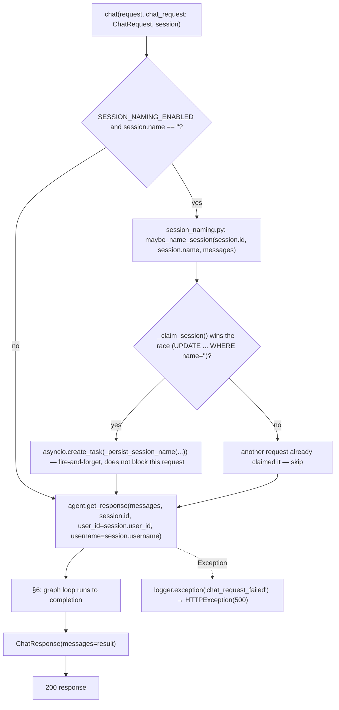

`_persist_session_name` (§ session_naming.py:25-39) itself makes a **second, independent LLM call** (`llm_service.call(..., model_name="gpt-5-nano", response_format=SessionTitle)`) that goes through the exact same retry/fallback machinery described in §7 — it just runs in the background and its failure is swallowed (only a metric + log, no user-facing effect).

---

## 5. Streaming chat turn — `POST /chatbot/chat/stream`

`app/api/v1/chatbot.py:chat_stream`. Session-naming branch is identical to §4; the difference is everything downstream of the agent call.

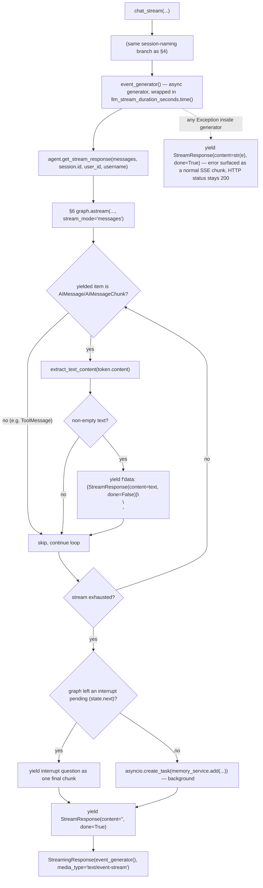

---

## 6. The chat ⇄ tool_call graph loop, in detail

This is the shared core called by both §4 and §5, in `LangGraphAgent` (`app/core/langgraph/graph.py`).

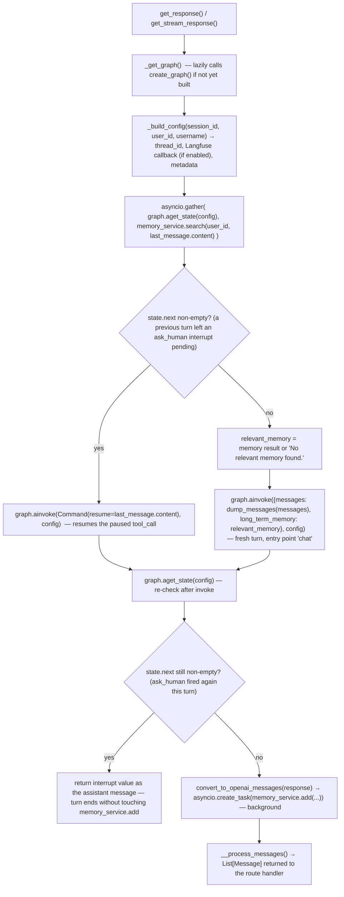

Inside the compiled `StateGraph` itself (`create_graph`, `app/core/langgraph/graph.py:125-155`), the two nodes are:

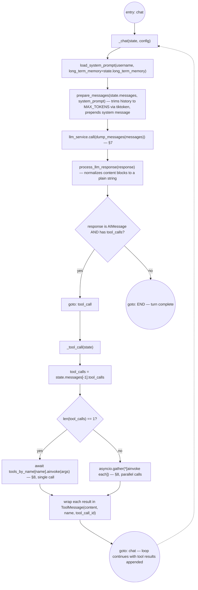

`tool_call` is registered with `RetryPolicy(max_attempts=3)` (`graph.py:132`) — a raised exception inside `_tool_call` itself (not inside an individual tool call, which already catches its own exceptions — see §8) is retried by LangGraph up to 3 times before the graph run fails.

---

## 7. LLM call: retry + circular fallback

Every `llm_service.call(...)` (`app/services/llm/service.py`) — whether from the main chat node or from `_persist_session_name` — goes through the same two-layer resilience wrapper:

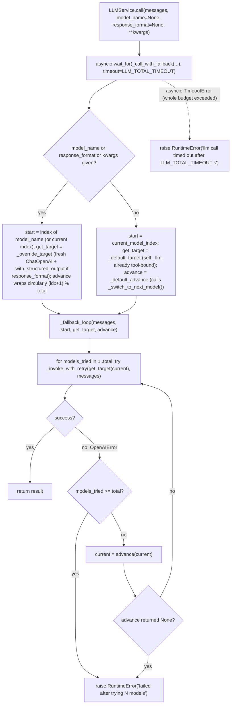

`_invoke_with_retry` (`service.py:82-96`) is itself a `tenacity`-decorated function: up to `MAX_LLM_CALL_RETRIES` attempts, exponential backoff (2s→10s), retried only on `RateLimitError | APITimeoutError | APIError` — any other `OpenAIError` propagates immediately to the fallback loop, which then switches models instead of retrying the same one.

Model order (circular fallback sequence) is fixed in `app/services/llm/registry.py:LLMRegistry.LLMS`: **`gpt-5-mini` → `gpt-5` → `gpt-5-nano` → (wraps back to `gpt-5-mini`)**.

---

## 8. Tool execution branches

Each tool called from `_tool_call` (§6) is independent and catches its own errors — a failing tool returns an error *string* to the model rather than raising, so one bad tool call never crashes the turn.

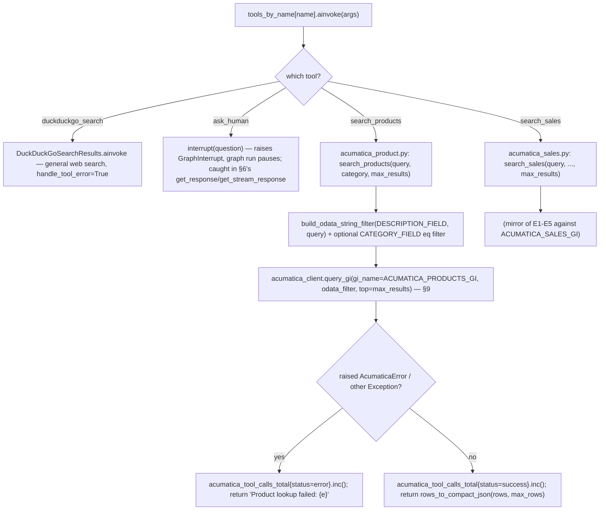

---

## 9. Acumatica session-cookie lifecycle

`AcumaticaClient.query_gi` (`app/services/acumatica.py:71-125`) — shared by both `search_products` and `search_sales`.

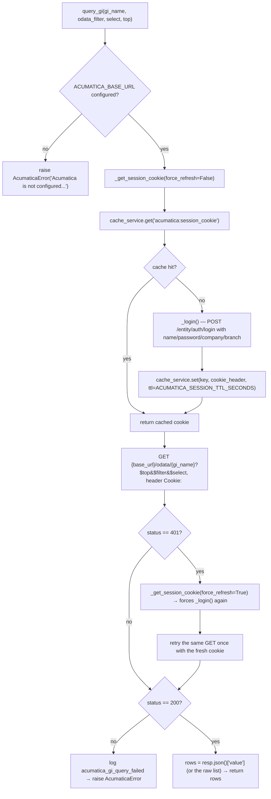

The whole `query_gi` call is additionally wrapped in a tenacity `@retry(stop_after_attempt(2), wait_exponential(...))` (`acumatica.py:70`) — so a transient network failure gets one extra full retry (including a fresh login if needed) on top of the 401-refresh-and-retry shown above.

---

## 10. Long-term memory read/write

`MemoryService` (`app/services/memory.py`) wraps `mem0.AsyncMemory` with a cache layer.

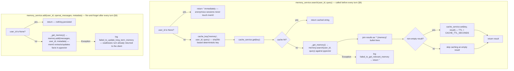

`_get_memory()` lazily constructs the single shared `AsyncMemory` instance on first use (or reuses the one built by `memory_service.initialize()` at startup, §1) — same instance for every user, differentiated only by the `user_id` argument passed into `search`/`add`.

---

## 11. Fetch / clear history

`GET /chatbot/messages` and `DELETE /chatbot/messages` (`app/api/v1/chatbot.py`), both behind `get_current_session` (§3.4):

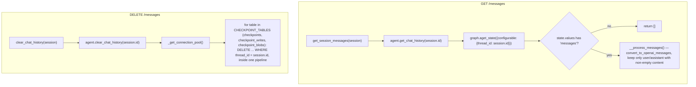

Note `clear_chat_history` deletes **checkpoint** rows only — it does not touch `memory_service` (mem0/pgvector long-term memory survives clearing a session's chat history, by design: long-term memory is per-user, not per-session).

---

## 12. Function index (file:line)

| Function | File |
|---|---|
| `lifespan`, `root`, `health_check`, `validation_exception_handler` | `app/main.py` |
| `register_user`, `login`, `create_session`, `delete_session`, `update_session_name`, `get_user_sessions`, `get_current_user`, `get_current_session` | `app/api/v1/auth.py` |
| `chat`, `chat_stream`, `get_session_messages`, `clear_chat_history` (route) | `app/api/v1/chatbot.py` |
| `create_access_token`, `verify_token` | `app/utils/auth.py` |
| `sanitize_string`, `sanitize_email`, `sanitize_dict`, `sanitize_list`, `validate_password_strength` | `app/utils/sanitization.py` |
| `User.hash_password`, `User.verify_password` | `app/models/user.py` |
| `MetricsMiddleware`, `LoggingContextMiddleware`, `ProfilingMiddleware` | `app/core/middleware.py` |
| `bind_context`, `clear_context`, `get_context`, `setup_logging` | `app/core/logging.py` |
| `langfuse_init`, `get_langfuse_callback_handler` | `app/core/observability.py` |
| `LangGraphAgent.{_chat,_tool_call,create_graph,get_response,get_stream_response,get_chat_history,clear_chat_history,__process_messages,_build_config,_get_connection_pool,_get_graph}` | `app/core/langgraph/graph.py` |
| `load_system_prompt` | `app/core/prompts/__init__.py` |
| `dump_messages`, `prepare_messages`, `process_llm_response`, `extract_text_content` | `app/utils/graph.py` |
| `LLMService.{call,_call_with_fallback,_fallback_loop,_invoke_with_retry,_switch_to_next_model,bind_tools,get_llm}` | `app/services/llm/service.py` |
| `LLMRegistry.{get,get_all_names,get_model_at_index}` | `app/services/llm/registry.py` |
| `maybe_name_session`, `_claim_session`, `_persist_session_name`, `_build_placeholder` | `app/services/session_naming.py` |
| `AcumaticaClient.{_login,_get_session_cookie,query_gi}`, `build_odata_string_filter`, `rows_to_compact_json` | `app/services/acumatica.py` |
| `search_products` | `app/core/langgraph/tools/acumatica_product.py` |
| `search_sales` | `app/core/langgraph/tools/acumatica_sales.py` |
| `ask_human` | `app/core/langgraph/tools/ask_human.py` |
| `duckduckgo_search_tool` | `app/core/langgraph/tools/duckduckgo_search.py` |
| `MemoryService.{search,add,initialize,_get_memory}` | `app/services/memory.py` |
| `InMemoryCacheService`, `ValkeyCacheService`, `cache_key`, `_create_cache_service` | `app/core/cache.py` |
| `DatabaseService.{create_user,get_user,get_user_by_email,create_session,delete_session,get_session,get_user_sessions,update_session_name,health_check}` | `app/services/database.py` |
| `limiter` (slowapi instance) | `app/core/limiter.py` |
