# Data Flow — complete function connection map

This document is the literal call graph of the system: every function that runs between an HTTP request arriving and a response leaving, with what goes **in**, what comes **out**, what it **calls** (its exit points to the next function), and what **calls it** (its entry point from the previous function). Nothing here is paraphrased — every signature, branch, and side effect is taken directly from the source at the cited `file:line`.

Companion docs: [`README.md`](README.md) (what the system is), [`docs/architecture.md`](docs/architecture.md) (narrative overview). This file is the detailed trace beneath both.

## How to read this document

Every function gets a **contract row** in one of the tables below:

| Column | Meaning |
|---|---|
| Function | Exact symbol name |
| File:line | Where it's defined |
| In | Every parameter, its type, and where the caller got the value from |
| Out | Return type/value and what it means |
| Calls → | Every function/method/library call it makes, in execution order (its exit points) |
| Called by ← | Every place in the codebase that invokes it (its entry points) |

A Mermaid flowchart precedes each table to show the *shape* of the flow (branches, loops); the table beneath it is the *contract* for every node in that flowchart. Read them together: the diagram tells you the path, the table tells you what's flowing along it.

## Contents

1. [Master entry → exit map](#1-master-entry--exit-map)
2. [App startup](#2-app-startup)
3. [Request entry — middleware chain](#3-request-entry--middleware-chain)
4. [Auth: register](#4-auth-register)
5. [Auth: login](#5-auth-login)
6. [Auth: session create / list / rename / delete](#6-auth-session-create--list--rename--delete)
7. [Token verification dependencies](#7-token-verification-dependencies)
8. [JWT internals — token creation & verification](#8-jwt-internals--token-creation--verification)
9. [Chat turn — full reply](#9-chat-turn--full-reply)
10. [Chat turn — streamed reply](#10-chat-turn--streamed-reply)
11. [LangGraphAgent internals — the chat ⇄ tool_call graph](#11-langgraphagent-internals--the-chat--tool_call-graph)
12. [LLM service — retry + circular fallback](#12-llm-service--retry--circular-fallback)
13. [Tool contracts](#13-tool-contracts)
14. [Acumatica client](#14-acumatica-client)
15. [Memory service](#15-memory-service)
16. [Session auto-naming](#16-session-auto-naming)
17. [Database service (all CRUD)](#17-database-service-all-crud)
18. [Cache service](#18-cache-service)
19. [Message/prompt utilities](#19-messageprompt-utilities)
20. [Sanitization utilities](#20-sanitization-utilities)
21. [Middleware, logging & observability internals](#21-middleware-logging--observability-internals)
22. [Data shapes that flow through everything](#22-data-shapes-that-flow-through-everything)
23. [Master function index](#23-master-function-index)

---

## 1. Master entry → exit map

Every possible request this system serves, and which section of this document traces it end to end:

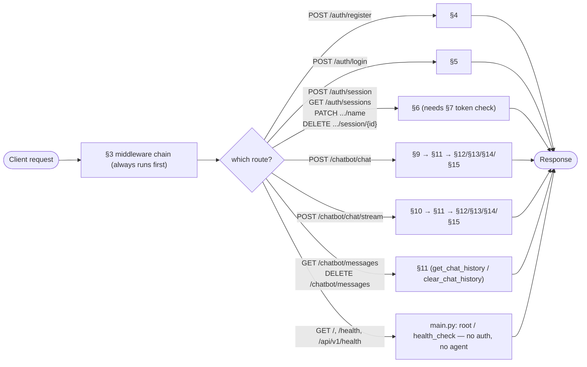

Everything downstream of §9/§10 funnels through the **same** `LangGraphAgent` (§11), which is itself the only caller of the LLM service (§12), the tools (§13, which call §14 Acumatica), and the memory service (§15). There is exactly one path into each of those subsystems — no route handler talks to them directly.

---

## 2. App startup

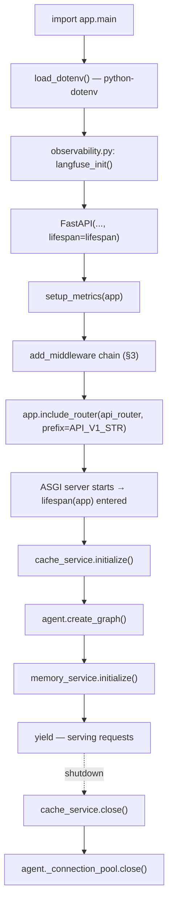

| Function | File:line | In | Out | Calls → | Called by ← |
|---|---|---|---|---|---|
| `lifespan(app)` | `app/main.py:32-58` | `app`: the `FastAPI` instance (unused in the body; captured for the `@asynccontextmanager` signature) | Async generator — `yield`s once, no value; runs cleanup after `yield` on shutdown | `cache_service.initialize()`, `agent.create_graph()`, `memory_service.initialize()` (each wrapped in its own `try/except`, so one failing doesn't block the others), then on shutdown `cache_service.close()`, `agent._connection_pool.close()` | Passed to `FastAPI(lifespan=lifespan)` at `main.py:66`; invoked by Uvicorn on process start/stop |
| `langfuse_init()` | `app/core/observability.py:10-33` | none (reads `settings.LANGFUSE_*`) | `None` | `Langfuse(...)`, `langfuse.auth_check()` | `main.py:29`, at import time |
| `setup_metrics(app)` | `app/core/metrics.py:34-37` | `app: FastAPI` | `None` | `app.add_middleware(PrometheusMiddleware)`, `app.add_route("/metrics", metrics)` | `main.py:69` |
| `get_langfuse_callback_handler()` | `app/core/observability.py:36-38` | none | `CallbackHandler` (LangChain/LangGraph tracer) | `CallbackHandler()` | Module level — result bound to `langfuse_callback_handler`, imported by `graph.py:_build_config` |

---

## 3. Request entry — middleware chain

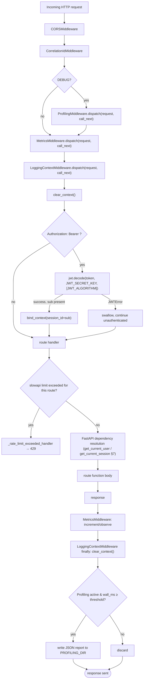

| Function | File:line | In | Out | Calls → | Called by ← |
|---|---|---|---|---|---|
| `MetricsMiddleware.dispatch(request, call_next)` | `app/core/middleware.py:37-51` | `request: Request`; `call_next: Callable` (the next ASGI layer, ultimately the route handler) | `Response` (passthrough) | `call_next(request)`, `http_requests_total.labels(method, endpoint, status).inc()`, `http_request_duration_seconds.labels(method, endpoint).observe(duration)` | Registered via `app.add_middleware` in `main.py:71`; invoked by Starlette for every request |
| `LoggingContextMiddleware.dispatch(request, call_next)` | `app/core/middleware.py:57-74` | `request`, `call_next` | `Response` (passthrough) | `clear_context()`, `jwt.decode(...)` (own inline decode, not `verify_token`), `bind_context(session_id=...)`, `call_next(request)`, `bind_context(user_id=...)` if `request.state.user_id` was set downstream, `clear_context()` in `finally` | `main.py:70` |
| `ProfilingMiddleware.dispatch(request, call_next)` | `app/core/middleware.py:82-125` | `request`, `call_next` | `Response` (passthrough) | `tracemalloc.start()`, `Profiler()`, `call_next(request)`, `tracemalloc.get_traced_memory()`, `tracemalloc.take_snapshot()`, `profiler.output(renderer=JSONRenderer())`, `filepath.write_text(...)` if over threshold | `main.py:73`, only when `settings.DEBUG` |
| `bind_context(**kwargs)` | `app/core/logging.py:18-21` | Arbitrary keyword args (`session_id=...`, `user_id=...`) | `None` | `_request_context.set({**current, **kwargs})` (a `ContextVar`) | `LoggingContextMiddleware`, `get_current_user`, `get_current_session` |
| `clear_context()` | `app/core/logging.py:24-26` | none | `None` | `_request_context.set(None)` | `LoggingContextMiddleware` (start and `finally`) |
| `get_context()` | `app/core/logging.py:29-31` | none | `Dict[str, Any]` — current bound context, or `{}` | reads `_request_context` | `_add_context` structlog processor (every log call) |

---

## 4. Auth: register

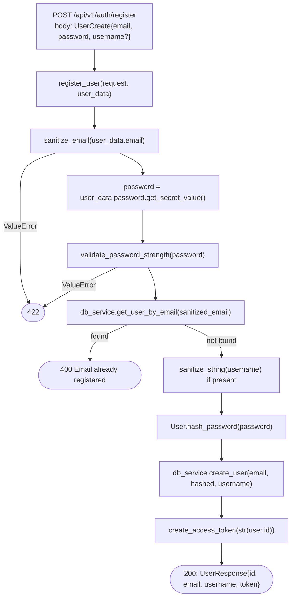

| Function | File:line | In | Out | Calls → | Called by ← |
|---|---|---|---|---|---|
| `register_user(request, user_data)` | `app/api/v1/auth.py:58-77` | `request: Request` (unused, required by `@limiter.limit`); `user_data: UserCreate {email: EmailStr, password: SecretStr, username: str\|None}` from the JSON body | `UserResponse {id: int, email: str, username: str\|None, token: Token}` → 200; or `HTTPException(400)` / `(422)` | `sanitize_email`, `user_data.password.get_secret_value()`, `validate_password_strength`, `db_service.get_user_by_email`, `sanitize_string`, `User.hash_password`, `db_service.create_user`, `create_access_token` | FastAPI router (`POST /auth/register`) |
| `sanitize_email(email)` | `app/utils/sanitization.py:8-13` | `email: str` | `str` — lowercased, HTML-escaped; raises `ValueError` if it doesn't match the email regex | `sanitize_string(email)`, `re.match` | `register_user` |
| `validate_password_strength(password)` | `app/utils/sanitization.py:16-28` | `password: str` (plaintext) | `True` on success; raises `ValueError` describing the first failed rule | 5 `re.search` checks (length, upper, lower, digit, special char) | `register_user` (also re-validated by the `UserCreate.validate_password` Pydantic field validator, `app/schemas/auth.py:28-42`, before the handler body even runs) |
| `User.hash_password(password)` (staticmethod) | `app/models/user.py:27-30` | `password: str` (plaintext) | `str` — bcrypt hash (utf-8 decoded) | `bcrypt.hashpw(password.encode(), bcrypt.gensalt())` | `register_user` |
| `DatabaseService.create_user(email, password, username=None)` | `app/services/database.py:41-49` | `email: str`, `password: str` (already hashed), `username: str\|None` | `User` (the inserted row, refreshed with its generated `id`) | `Session(self.engine)`, `session.add`, `session.commit`, `session.refresh` | `register_user` |
| `create_access_token(thread_id)` | `app/utils/auth.py:15-26` | see §8 | see §8 | see §8 | `register_user`, `login`, `create_session`, `update_session_name`, `get_user_sessions` |

---

## 5. Auth: login

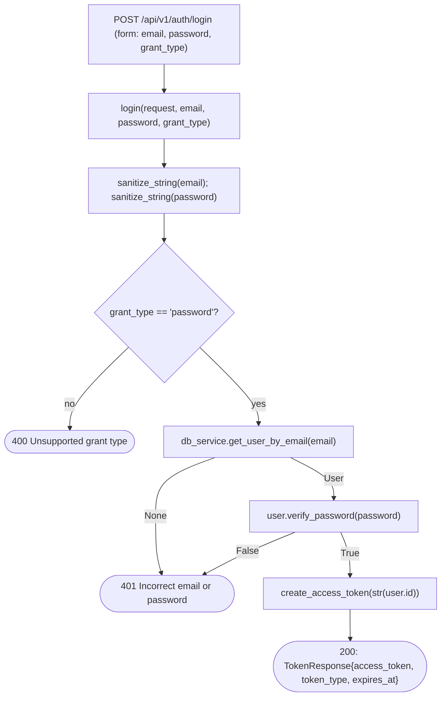

| Function | File:line | In | Out | Calls → | Called by ← |
|---|---|---|---|---|---|
| `login(request, email, password, grant_type)` | `app/api/v1/auth.py:82-96` | `email: str`, `password: str`, `grant_type: str = "password"` — all `Form(...)` fields | `TokenResponse {access_token, token_type: "bearer", expires_at}` → 200; or `HTTPException(400)` / `(401)` | `sanitize_string` ×2, `db_service.get_user_by_email`, `user.verify_password`, `create_access_token` | FastAPI router (`POST /auth/login`) |
| `User.verify_password(self, password)` | `app/models/user.py:23-25` | `self: User` (has `.hashed_password`); `password: str` (plaintext candidate) | `bool` | `bcrypt.checkpw(password.encode(), self.hashed_password.encode())` | `login` |
| `DatabaseService.get_user_by_email(email)` | `app/services/database.py:56-59` | `email: str` | `Optional[User]` | `session.exec(select(User).where(User.email == email)).first()` | `login`, `register_user` |

---

## 6. Auth: session create / list / rename / delete

```mermaid
flowchart TD
    subgraph create["POST /auth/session"]
        A1["create_session(user)"] --> A2["uuid.uuid4()"]
        A2 --> A3["db_service.create_session(session_id, user.id, username=user.username)"]
        A3 --> A4["create_access_token(session_id)"]
        A4 --> A5(["200: SessionResponse"])
    end
    subgraph list["GET /auth/sessions"]
        B1["get_user_sessions(user)"] --> B2["db_service.get_user_sessions(user.id)"]
        B2 --> B3["for each: sanitize_string(s.id/s.name), create_access_token(s.id)"]
        B3 --> B4(["200: List[SessionResponse]"])
    end
    subgraph rename["PATCH /auth/session/{id}/name"]
        C1["update_session_name(session_id, name, current_session)"] --> C2{"session_id == current_session.id?"}
        C2 -- no --> C3(["403"])
        C2 -- yes --> C4["db_service.update_session_name(id, sanitize_string(name))"]
        C4 --> C5["create_access_token(id)"]
        C5 --> C6(["200: SessionResponse"])
    end
    subgraph del["DELETE /auth/session/{id}"]
        D1["delete_session(session_id, current_session)"] --> D2{"session_id == current_session.id?"}
        D2 -- no --> D3(["403"])
        D2 -- yes --> D4["db_service.delete_session(id)"]
        D4 --> D5(["200"])
    end
```

| Function | File:line | In | Out | Calls → | Called by ← |
|---|---|---|---|---|---|
| `create_session(user)` | `app/api/v1/auth.py:100-107` | `user: User` — injected by `Depends(get_current_user)` (§7) | `SessionResponse {session_id, name: "", token}` → 200 | `uuid.uuid4()`, `db_service.create_session`, `create_access_token`, `logger.info` | FastAPI router (`POST /auth/session`) |
| `get_user_sessions(user)` | `app/api/v1/auth.py:136-143` | `user: User` from `Depends(get_current_user)` | `List[SessionResponse]` → 200, one token **freshly minted per session** in the list | `db_service.get_user_sessions`, `sanitize_string` (id + name), `create_access_token` (once per session) | FastAPI router (`GET /auth/sessions`) |
| `update_session_name(session_id, name, current_session)` | `app/api/v1/auth.py:123-131` | `session_id: str` (path); `name: str` (`Form`); `current_session: Session` from `Depends(get_current_session)` | `SessionResponse` → 200; or `HTTPException(403)` | `sanitize_string` ×2, `db_service.update_session_name`, `create_access_token` | FastAPI router (`PATCH /auth/session/{id}/name`) |
| `delete_session(session_id, current_session)` | `app/api/v1/auth.py:112-118` | `session_id: str` (path); `current_session: Session` from `Depends(get_current_session)` | `None` → 200; or `HTTPException(403)` | `sanitize_string` ×2, `db_service.delete_session`, `logger.info` | FastAPI router (`DELETE /auth/session/{id}`) |
| `DatabaseService.create_session(session_id, user_id, name="", username=None)` | `app/services/database.py:61-71` | `session_id: str` (UUID), `user_id: int`, `name: str`, `username: str\|None` | `ChatSession` (inserted, refreshed) | `Session(engine)`, `session.add/commit/refresh` | `create_session` |
| `DatabaseService.get_user_sessions(user_id)` | `app/services/database.py:88-92` | `user_id: int` | `List[ChatSession]`, ordered by `created_at` | `session.exec(select(...).order_by(...))` | `get_user_sessions` |
| `DatabaseService.update_session_name(session_id, name)` | `app/services/database.py:94-104` | `session_id: str`, `name: str` | `ChatSession` (updated); raises `HTTPException(404)` if missing | `session.get`, `session.add/commit/refresh` | `update_session_name`, `_persist_session_name` (§16) |
| `DatabaseService.delete_session(session_id)` | `app/services/database.py:73-81` | `session_id: str` | `bool` — `True` if deleted, `False` if not found | `session.get`, `session.delete`, `session.commit` | `delete_session` |

---

## 7. Token verification dependencies

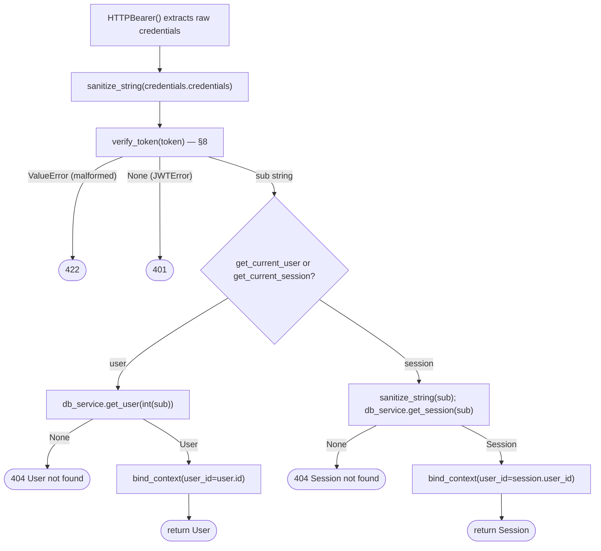

| Function | File:line | In | Out | Calls → | Called by ← |
|---|---|---|---|---|---|
| `get_current_user(credentials)` | `app/api/v1/auth.py:26-39` | `credentials: HTTPAuthorizationCredentials` — injected by `Depends(HTTPBearer())` from the `Authorization: Bearer <token>` header | `User` (resolved row); raises `HTTPException(401)`, `(404)`, or `(422)` | `sanitize_string`, `verify_token`, `db_service.get_user`, `bind_context` | `Depends(get_current_user)` in `create_session`, `get_user_sessions` |
| `get_current_session(credentials)` | `app/api/v1/auth.py:41-55` | same as above | `Session` (resolved chat session row); same exception set | `sanitize_string` ×2, `verify_token`, `db_service.get_session`, `bind_context` | `Depends(get_current_session)` in `delete_session`, `update_session_name`, `chat`, `chat_stream`, `get_session_messages`, `clear_chat_history` |
| `DatabaseService.get_user(user_id)` | `app/services/database.py:51-54` | `user_id: int` | `Optional[User]` | `session.get(User, user_id)` | `get_current_user` |
| `DatabaseService.get_session(session_id)` | `app/services/database.py:83-86` | `session_id: str` | `Optional[ChatSession]` | `session.get(ChatSession, session_id)` | `get_current_session` |

---

## 8. JWT internals — token creation & verification

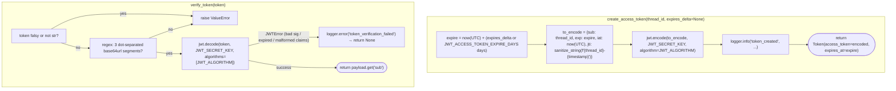

| Function | File:line | In | Out | Calls → | Called by ← |
|---|---|---|---|---|---|
| `create_access_token(thread_id, expires_delta=None)` | `app/utils/auth.py:15-26` | `thread_id: str` — **either** a user's `id` (as string) **or** a session UUID string, depending on caller; `expires_delta: Optional[timedelta]` — override for the default `JWT_ACCESS_TOKEN_EXPIRE_DAYS` | `Token {access_token: str (JWT), token_type: "bearer", expires_at: datetime}` | `datetime.now(UTC)`, `sanitize_string`, `jwt.encode(payload, JWT_SECRET_KEY, algorithm=JWT_ALGORITHM)`, `logger.info` | `register_user`, `login`, `create_session`, `update_session_name`, `get_user_sessions` (×N) |
| `verify_token(token)` | `app/utils/auth.py:29-41` | `token: str` — the raw bearer string, already `sanitize_string`-passed by the caller | `Optional[str]` — the JWT's `sub` claim, or `None` if the signature/claims fail to verify; raises `ValueError` if the string isn't even JWT-shaped | `re.match` (structural check), `jwt.decode(token, JWT_SECRET_KEY, algorithms=[JWT_ALGORITHM])`, `logger.error` | `get_current_user`, `get_current_session` |

**The encode payload, field by field:**

| Claim | Value | Purpose |
|---|---|---|
| `sub` | `thread_id` argument, verbatim | The only thing that distinguishes a "user token" from a "session token" — nothing else in the payload encodes token type |
| `exp` | `now(UTC) + JWT_ACCESS_TOKEN_EXPIRE_DAYS` | Standard JWT expiry; `jose.jwt.decode` rejects the token past this instant |
| `iat` | `now(UTC)` | Issued-at, informational only — not checked on verify |
| `jti` | `sanitize_string(f"{thread_id}-{timestamp}")` | A unique-per-mint id; **not stored or checked anywhere** — there is no revocation list, so a `jti` collision or reuse has no effect |

There is no refresh-token endpoint and no server-side blacklist: an expired token can only be replaced by calling `/login` or `/auth/session` again, and a leaked token stays valid until `exp` or until `JWT_SECRET_KEY` is rotated (which invalidates every outstanding token at once, for every user, simultaneously).

---

## 9. Chat turn — full reply

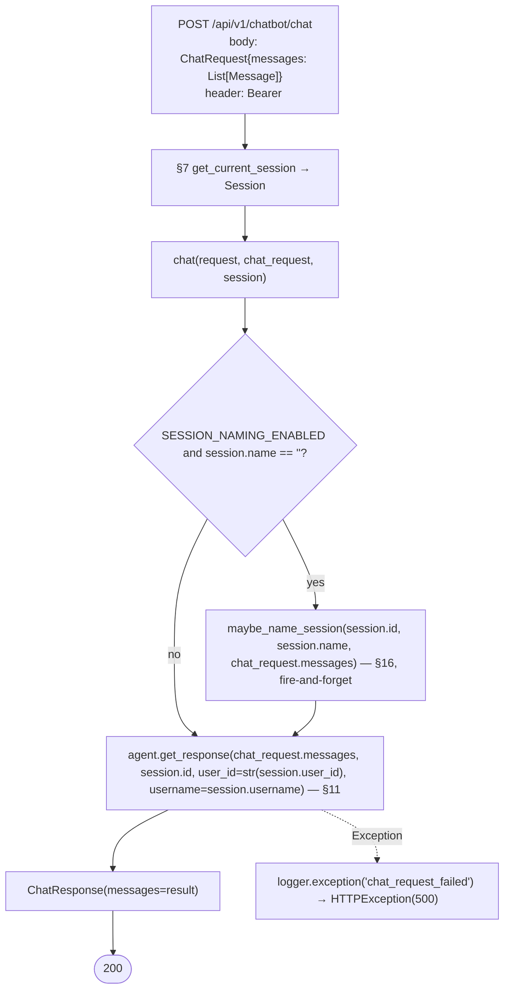

| Function | File:line | In | Out | Calls → | Called by ← |
|---|---|---|---|---|---|
| `chat(request, chat_request, session)` | `app/api/v1/chatbot.py:22-35` | `chat_request: ChatRequest {messages: List[Message]}` (JSON body); `session: Session` from `Depends(get_current_session)` | `ChatResponse {messages: List[Message]}` → 200; or `HTTPException(500)` | `maybe_name_session` (conditionally), `agent.get_response`, `logger.exception` (on error) | FastAPI router (`POST /chatbot/chat`) |

Everything past `agent.get_response` is traced in §11 (the graph loop), which in turn calls §12 (LLM), §13 (tools), §14 (Acumatica, via the tools), and §15 (memory).

---

## 10. Chat turn — streamed reply

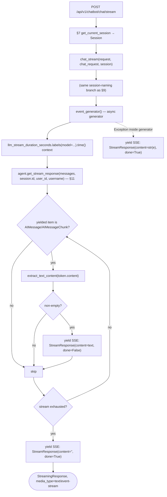

| Function | File:line | In | Out | Calls → | Called by ← |
|---|---|---|---|---|---|
| `chat_stream(request, chat_request, session)` | `app/api/v1/chatbot.py:38-57` | Same as `chat` (§9) | `StreamingResponse` (media type `text/event-stream`) wrapping `event_generator()` | `maybe_name_session` (conditionally), constructs `event_generator` | FastAPI router (`POST /chatbot/chat/stream`) |
| `event_generator()` (nested async generator) | `app/api/v1/chatbot.py:45-56` | Closure over `chat_request`, `session`, `agent` | Async stream of `"data: {...}\n\n"` SSE lines; each is a JSON-encoded `StreamResponse {content: str, done: bool}` | `agent.llm_service.get_llm().get_name()` (for the metric label), `agent.get_stream_response`, `json.dumps`, `logger.exception` on failure | `chat_stream` |
| `get_session_messages(request, session)` | `app/api/v1/chatbot.py:60-67` | `session: Session` from `Depends(get_current_session)` | `ChatResponse {messages}` → 200; or `HTTPException(500)` | `agent.get_chat_history` (§11) | FastAPI router (`GET /chatbot/messages`) — see §17 for full trace |
| `clear_chat_history(request, session)` (route) | `app/api/v1/chatbot.py:70-78` | `session: Session` | `{"message": "Chat history cleared successfully"}` → 200; or `HTTPException(500)` | `agent.clear_chat_history` (§11) | FastAPI router (`DELETE /chatbot/messages`) — see §17 |

---

## 11. LangGraphAgent internals — the chat ⇄ tool_call graph

This is the shared core reached from §9 and §10. `LangGraphAgent` is instantiated once (`agent = LangGraphAgent()` at `app/api/v1/chatbot.py:19`) and reused for every request.

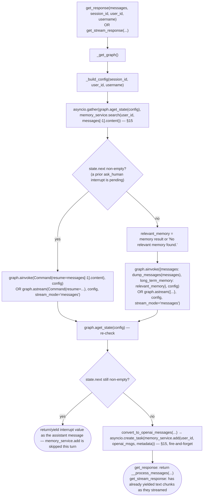

Inside the compiled graph itself:

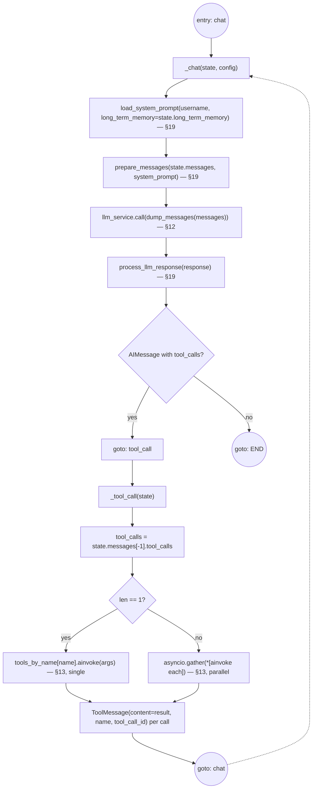

| Function | File:line | In | Out | Calls → | Called by ← |
|---|---|---|---|---|---|
| `LangGraphAgent.__init__(self)` | `graph.py:52-58` | none | — | `llm_service.bind_tools(tools)` (§12/§13), builds `tools_by_name` dict | Module import (`chatbot.py:19`) |
| `_get_connection_pool()` | `graph.py:60-85` | none | `Optional[PostgresConnPool]` — `None` only in production if pool creation fails | `AsyncConnectionPool(connection_url, ...)`, `pool.open()` | `create_graph`, `clear_chat_history` |
| `_chat(state, config)` | `graph.py:87-109` | `state: GraphState {messages, long_term_memory}`; `config: RunnableConfig` (has `configurable.thread_id`, `metadata.username`) | `Command(update={"messages": [response_message]}, goto="tool_call"\|END)` | `llm_service.get_llm`, `load_system_prompt`, `prepare_messages`, `llm_service.call`, `process_llm_response`, `llm_inference_duration_seconds.labels(...).time()` | LangGraph runtime (entry node of every turn) |
| `_tool_call(state)` | `graph.py:111-123` | `state: GraphState` — reads `state.messages[-1].tool_calls` | `Command(update={"messages": outputs: list[ToolMessage]}, goto="chat")` | `tools_by_name[name].ainvoke(args)` (§13), `asyncio.gather` if >1 call | LangGraph runtime, entered only when `_chat` routed here |
| `create_graph()` | `graph.py:125-155` | none | `Optional[CompiledStateGraph]` (cached on `self._graph` after first call) | `StateGraph(GraphState)`, `add_node` ×2, `set_entry_point`, `set_finish_point`, `_get_connection_pool`, `AsyncPostgresSaver(pool)`, `checkpointer.setup()`, `graph_builder.compile(...)` | `lifespan` (startup pre-warm), `_get_graph` |
| `_get_graph()` | `graph.py:157-162` | none | `CompiledStateGraph`; raises `RuntimeError` if unavailable | `create_graph()` if `self._graph is None` | `get_response`, `get_stream_response`, `get_chat_history` |
| `_build_config(session_id, user_id, username)` | `graph.py:164-176` | `session_id: str`, `user_id: Optional[str]`, `username: Optional[str]` | `RunnableConfig {configurable: {thread_id: session_id}, callbacks: [langfuse_callback_handler] if enabled, metadata: {user_id, username, session_id, environment, debug}}` | none (pure construction) | `get_response`, `get_stream_response` |
| `get_response(messages, session_id, user_id=None, username=None)` | `graph.py:178-213` | `messages: list[Message]`; `session_id: str`; `user_id`, `username`: `Optional[str]` | `list[Message]` — the new assistant/user turns; raises on unrecoverable errors | `_get_graph`, `_build_config`, `graph.aget_state`, `memory_service.search` (§15), `graph.ainvoke`, `memory_service.add` (§15, background task), `__process_messages` | `chat` route (§9) |
| `get_stream_response(messages, session_id, user_id=None, username=None)` | `graph.py:215-253` | Same as `get_response` | `AsyncGenerator[str, None]` — yields text chunks as they stream | Same as `get_response`, plus `graph.astream(..., stream_mode="messages")`, `extract_text_content` (§19) | `chat_stream` route (§10), inside `event_generator` |
| `get_chat_history(session_id)` | `graph.py:255-259` | `session_id: str` | `list[Message]` — `[]` if no state exists | `_get_graph`, `graph.aget_state`, `__process_messages` | `get_session_messages` route (§10) |
| `__process_messages(messages)` | `graph.py:261-267` | `messages: list[BaseMessage]` | `list[Message]` — only `user`/`assistant` roles with non-empty content | `convert_to_openai_messages` | `get_response`, `get_chat_history` |
| `clear_chat_history(session_id)` | `graph.py:269-280` | `session_id: str` | `None`; raises `RuntimeError` if the connection pool is unavailable | `_get_connection_pool`, `conn.execute(DELETE ... WHERE thread_id = %s)` per table in `settings.CHECKPOINT_TABLES` | `clear_chat_history` route (§10) |

---

## 12. LLM service — retry + circular fallback

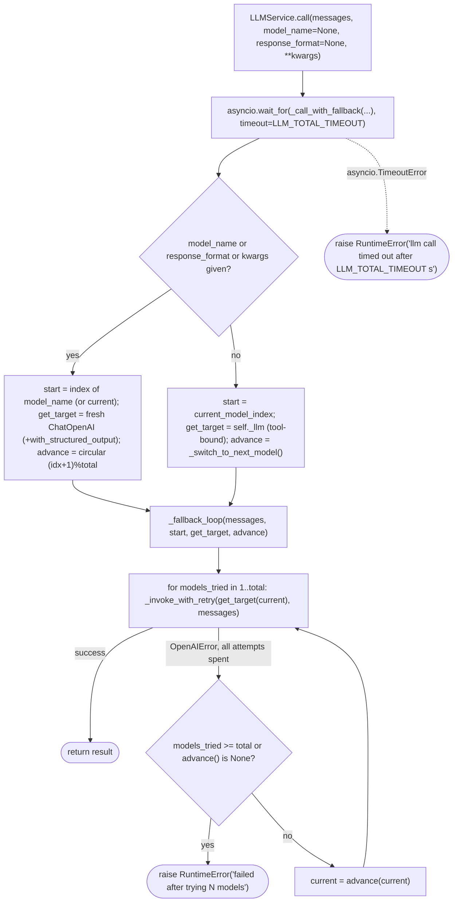

| Function | File:line | In | Out | Calls → | Called by ← |
|---|---|---|---|---|---|
| `LLMService.__init__(self)` | `service.py:23-35` | none | — | `LLMRegistry.get_all_names`, `LLMRegistry.get(DEFAULT_LLM_MODEL)` (falls back to `LLMS[0]` on failure) | Module import — `llm_service = LLMService()` singleton |
| `call(messages, model_name=None, response_format=None, **model_kwargs)` | `service.py:55-69` | `messages: LanguageModelInput` (list of message dicts); `model_name: Optional[str]` — force a specific model instead of the current one; `response_format: Optional[Type[BaseModel]]` — request structured output; `**model_kwargs` — extra `ChatOpenAI` kwargs (e.g. `temperature`, `max_tokens`) | `BaseMessage` (normal call) or an instance of `response_format` (structured call); raises `RuntimeError` on total-timeout | `asyncio.wait_for(self._call_with_fallback(...))` | `_chat` (§11), `_persist_session_name` (§16) |
| `get_llm()` | `service.py:71-73` | none | `Any` — the current tool-bound `ChatOpenAI` instance | none | `_chat` (for `model_name`/`get_name()`), `chat_stream`'s `event_generator` |
| `bind_tools(tools)` | `service.py:75-80` | `tools: List[BaseTool]` | `LLMService` (`self`, for chaining) | `self._llm.bind_tools(tools)` | `LangGraphAgent.__init__` |
| `_invoke_with_retry(llm, messages)` | `service.py:82-96` | `llm: Any` (a `ChatOpenAI` instance, possibly tool-bound); `messages` | Provider response object; re-raises `RateLimitError`/`APITimeoutError`/`APIError` (retried by the `@retry` decorator, up to `MAX_LLM_CALL_RETRIES` attempts, 2s–10s exponential backoff) or any other `OpenAIError` (not retried here) | `llm.ainvoke(messages)` | `_fallback_loop` |
| `_switch_to_next_model()` | `service.py:98-110` | none | `bool` — `True` if the switch succeeded | `LLMRegistry.get_model_at_index`, `self._llm.bind_tools` if tools were bound | `_call_with_fallback`'s default `advance` closure |
| `_call_with_fallback(messages, model_name, response_format, model_kwargs)` | `service.py:112-142` | See `call` | Delegates to `_fallback_loop`; same return contract as `call` | `LLMRegistry.get_all_names`, `LLMRegistry.get`, `base.with_structured_output`, `_fallback_loop` | `call` |
| `_fallback_loop(messages, start, get_target, advance)` | `service.py:144-164` | `start: int` (starting model index); `get_target: Callable[[int], Any]`; `advance: Callable[[int], Optional[int]]` | Provider response / structured model instance; raises `RuntimeError` once every model has been tried | `_invoke_with_retry`, `advance(current)` | `_call_with_fallback` |
| `LLMRegistry.get(model_name, **kwargs)` | `registry.py:39-48` | `model_name: str`; optional `**kwargs` (e.g. `temperature`) | `BaseChatModel` — the shared registry instance if no kwargs, else a fresh `ChatOpenAI`; raises `ValueError` if `model_name` isn't registered | `ChatOpenAI(...)` (only if kwargs given) | `LLMService.__init__`, `_call_with_fallback`'s override path, `_persist_session_name` (indirectly, via `call(model_name=...)`) |
| `LLMRegistry.get_all_names()` | `registry.py:50-53` | none | `List[str]` — `["gpt-5-mini", "gpt-5", "gpt-5-nano"]` | none | `LLMService.__init__`, `_call_with_fallback` |
| `LLMRegistry.get_model_at_index(index)` | `registry.py:55-60` | `index: int` | `Dict[str, Any] {name, llm}` — wraps to index 0 if out of range | none | `_switch_to_next_model` |

---

## 13. Tool contracts

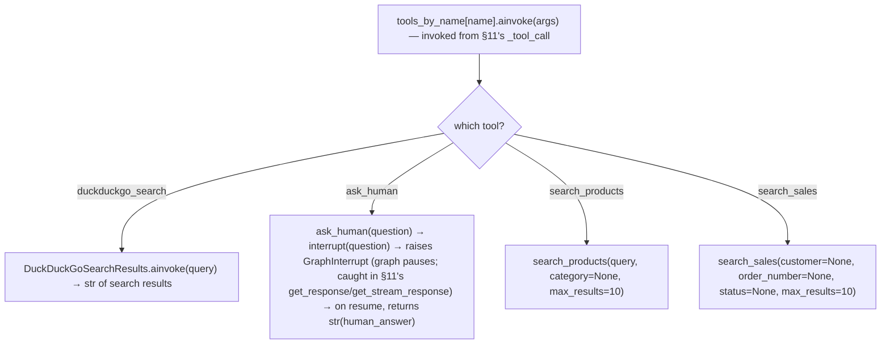

| Function | File:line | In | Out | Calls → | Called by ← |
|---|---|---|---|---|---|
| `search_products(query, category=None, max_results=10)` | `acumatica_product.py:22-60` | `query: str` (free text); `category: Optional[str]`; `max_results: int = 10` — all chosen by the LLM as tool-call arguments | `str` — compact JSON array of product rows, an "error: ..." message, or a lookup-failed string; never raises (caught internally) | `build_odata_string_filter(DESCRIPTION_FIELD, query)`, `acumatica_client.query_gi(gi_name=ACUMATICA_PRODUCTS_GI, ...)` (§14), `rows_to_compact_json`, `acumatica_tool_calls_total`/`acumatica_tool_duration_seconds` metrics | `_tool_call` (§11), via `tools_by_name["search_products"]` |
| `search_sales(customer=None, order_number=None, status=None, max_results=10)` | `acumatica_sales.py:22-83` | `customer`, `order_number`, `status`: all `Optional[str]`; `max_results: int = 10` | `str` — same contract as `search_products`; returns an early guidance string if **no** filter args were given at all | `build_odata_string_filter` (customer only), `acumatica_client.query_gi(gi_name=ACUMATICA_SALES_GI, ...)` (§14), `rows_to_compact_json`, same metrics | `_tool_call` (§11) |
| `ask_human(question)` | `ask_human.py:7-20` | `question: str` — chosen by the LLM | `str` — the human's answer, but only after a resume; the initial call never returns normally | `langgraph.types.interrupt(question)` — raises `GraphInterrupt`, unwinding the graph run entirely | `_tool_call` (§11) |
| `duckduckgo_search_tool` | `duckduckgo_search.py:5` | Not custom code — a `DuckDuckGoSearchResults(num_results=10, handle_tool_error=True)` instance from `langchain_community` | `.ainvoke(query: str) -> str` — formatted web search results | DuckDuckGo HTTP search (via `ddgs`) | `_tool_call` (§11) |
| `build_odata_string_filter(field, value)` | `acumatica.py:128-131` | `field: str` (OData field name); `value: str` (search text) | `str` — e.g. `substringof('value', field)`, with `'` escaped | none | `search_products`, `search_sales` |
| `rows_to_compact_json(rows, max_rows=15)` | `acumatica.py:134-138` | `rows: list[dict]`; `max_rows: int` | `str` — `"No matching records found."` if empty, else `json.dumps(rows[:max_rows])` | `json.dumps` | `search_products`, `search_sales` |

---

## 14. Acumatica client

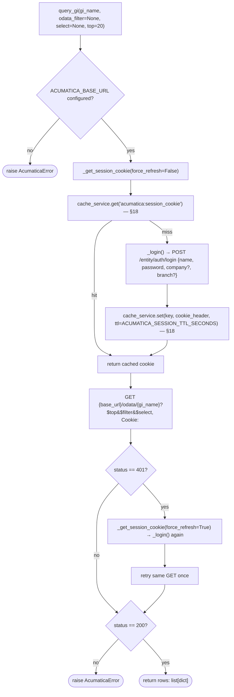

| Function | File:line | In | Out | Calls → | Called by ← |
|---|---|---|---|---|---|
| `AcumaticaClient.__init__(self)` | `acumatica.py:36-39` | none | — | reads `settings.ACUMATICA_BASE_URL`, logs a warning if unset | Module import — `acumatica_client = AcumaticaClient()` singleton |
| `_login()` | `acumatica.py:41-60` | none (reads `settings.ACUMATICA_USERNAME/PASSWORD/TENANT/BRANCH`) | `str` — the `Cookie:` header value; raises `AcumaticaError` if no cookie comes back | `httpx.AsyncClient.post("/entity/auth/login", json=payload)`, `cache_service.set` (§18) | `_get_session_cookie` |
| `_get_session_cookie(force_refresh=False)` | `acumatica.py:62-68` | `force_refresh: bool` | `str` — session cookie header | `cache_service.get` (§18), `_login` if absent/forced | `query_gi` (initial + on 401) |
| `query_gi(gi_name, odata_filter=None, select=None, top=20)` | `acumatica.py:71-125` | `gi_name: str` (OData entity name, e.g. `ProductsSimple`); `odata_filter: Optional[str]`; `select: Optional[str]`; `top: int = 20` | `list[dict[str, Any]]` — raw GI rows; raises `AcumaticaError` on non-200 or missing base URL | `_get_session_cookie`, `httpx.AsyncClient.get(url, params, headers)`, retried once on `401` via a forced `_get_session_cookie(force_refresh=True)`; whole function wrapped in a `tenacity` retry (2 attempts) | `search_products`, `search_sales` (§13) |

---

## 15. Memory service

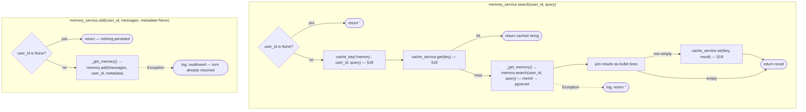

| Function | File:line | In | Out | Calls → | Called by ← |
|---|---|---|---|---|---|
| `MemoryService._get_memory()` | `memory.py:28-50` | none | `AsyncMemory` (lazily constructed once, cached on `self._memory`) | `AsyncMemory.from_config({vector_store: pgvector, llm: openai, embedder: openai})` | `initialize`, `search`, `add` |
| `initialize()` | `memory.py:52-55` | none | `None` | `_get_memory()` | `lifespan` (startup pre-warm) |
| `search(user_id, query)` | `memory.py:57-75` | `user_id: Optional[str]`; `query: str` (the latest user message content) | `str` — newline-joined `"* {memory}"` bullets, or `""` on no-user/no-result/error | `cache_key`, `cache_service.get`/`set` (§18), `memory.search(user_id, query)` | `get_response`, `get_stream_response` (§11) |
| `add(user_id, messages, metadata=None)` | `memory.py:77-85` | `user_id: Optional[str]`; `messages: list[dict]` (OpenAI-format turn); `metadata: Optional[dict]` (the graph's `config["metadata"]`) | `None`; failures are logged and swallowed | `_get_memory()`, `memory.add(messages, user_id, metadata)` | `get_response`, `get_stream_response` — always via `asyncio.create_task(...)`, i.e. fire-and-forget after the turn's response has already been prepared |

---

## 16. Session auto-naming

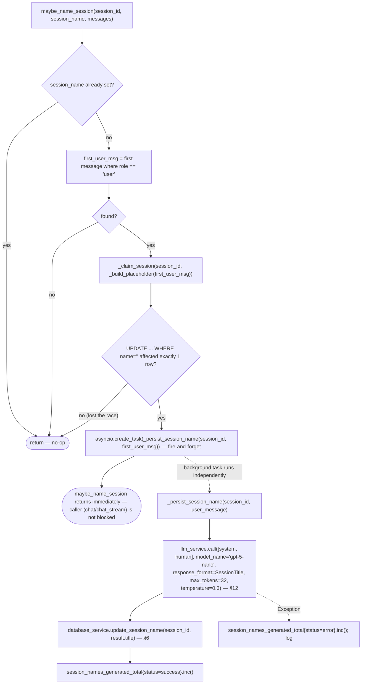

| Function | File:line | In | Out | Calls → | Called by ← |
|---|---|---|---|---|---|
| `maybe_name_session(session_id, session_name, messages)` | `session_naming.py:55-65` | `session_id: str`; `session_name: str` (current name, `""` if unnamed); `messages: list[Message]` (the incoming request's messages) | `None` — always returns immediately, regardless of branch | `_build_placeholder`, `_claim_session`, `asyncio.create_task(_persist_session_name(...))` | `chat`, `chat_stream` (§9/§10), only `if SESSION_NAMING_ENABLED` |
| `_build_placeholder(user_message)` | `session_naming.py:20-22` | `user_message: str` | `str` — whitespace-collapsed, truncated to 40 chars, or `"New chat"` if empty | `str.split`/`join`/`rstrip` | `maybe_name_session` |
| `_claim_session(session_id, placeholder)` | `session_naming.py:42-52` | `session_id: str`; `placeholder: str` | `bool` — `True` only if this call's `UPDATE` affected exactly one row (wins the race against concurrent requests for the same session) | `DBSession(engine)`, `update(ChatSession).where(id==session_id, name=="").values(name=placeholder)`, `db.exec`, `db.commit` | `maybe_name_session` |
| `_persist_session_name(session_id, user_message)` | `session_naming.py:25-39` | `session_id: str`; `user_message: str` (truncated to 500 chars before the LLM call) | `None`; failures logged and swallowed (the placeholder name from `_claim_session` remains) | `llm_service.call(..., model_name="gpt-5-nano", response_format=SessionTitle)` (§12), `database_service.update_session_name` (§6), `session_names_generated_total` metric | `asyncio.create_task` inside `maybe_name_session` |

---

## 17. Database service (all CRUD)

`DatabaseService` (`app/services/database.py`) is a synchronous SQLModel wrapper around one `Engine`, instantiated once per module (`database_service = DatabaseService()`, plus a second instance `db_service = DatabaseService()` in `auth.py:23` — two separate Python objects sharing the same connection pool configuration, not the same instance).

| Function | File:line | In | Out | Calls → | Called by ← |
|---|---|---|---|---|---|
| `DatabaseService.__init__(self)` | `database.py:20-39` | none | — | `create_engine(postgresql://..., poolclass=QueuePool, pool_size=POSTGRES_POOL_SIZE, ...)` | Module import (×2, see above) |
| `create_user` | `database.py:41-49` | see §4 | see §4 | — | `register_user` |
| `get_user` | `database.py:51-54` | see §7 | see §7 | — | `get_current_user` |
| `get_user_by_email` | `database.py:56-59` | see §5 | see §5 | — | `login`, `register_user` |
| `create_session` | `database.py:61-71` | see §6 | see §6 | — | `create_session` route |
| `delete_session` | `database.py:73-81` | see §6 | see §6 | — | `delete_session` route |
| `get_session` | `database.py:83-86` | see §7 | see §7 | — | `get_current_session` |
| `get_user_sessions` | `database.py:88-92` | see §6 | see §6 | — | `get_user_sessions` route |
| `update_session_name` | `database.py:94-104` | see §6 | see §6 | — | `update_session_name` route, `_persist_session_name` (§16) |
| `health_check()` | `database.py:106-114` | none | `bool` — `True` if `SELECT 1` succeeds | `session.exec(select(1))` | `main.py: health_check` route |

---

## 18. Cache service

Two interchangeable implementations behind the same four-method interface; `_create_cache_service()` picks one at import time based on config.

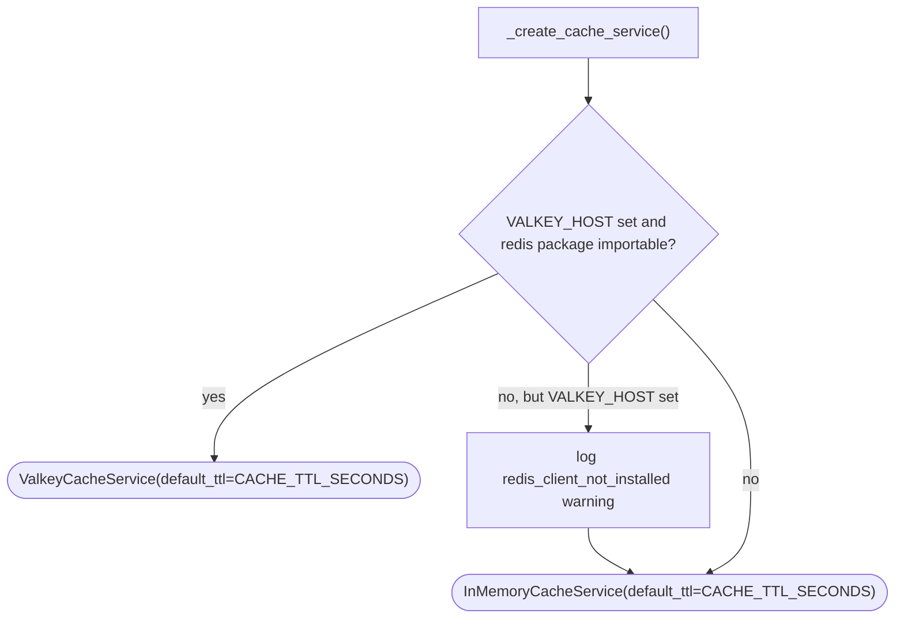

| Function | File:line | In | Out | Calls → | Called by ← |
|---|---|---|---|---|---|
| `cache_key(prefix, *parts)` | `cache.py:106-110` | `prefix: str`; `*parts: str` | `str` — `"{prefix}:{sha256(parts)[:16]}"`, deterministic | `hashlib.sha256` | `memory_service.search` (§15) |
| `InMemoryCacheService.get(key)` | `cache.py:28-36` | `key: str` | `Optional[str]`; expired entries return `None` and self-delete | dict lookup, `time.monotonic()` | `acumatica_client._get_session_cookie`, `memory_service.search`, (and `set`/`initialize`/`close` analogues) |
| `InMemoryCacheService.set(key, value, ttl=None)` | `cache.py:38-39` | `key: str`; `value: str`; `ttl: Optional[int]` (defaults to `self._default_ttl`) | `None` | dict write | `acumatica._login`, `memory_service.search` |
| `ValkeyCacheService.get/set/delete/close` | `cache.py:67-94` | Same signatures as `InMemoryCacheService` | Same contracts; failures are caught and logged (never raise — a Redis outage degrades to cache-misses, not errors) | `redis.asyncio.Redis.get/set/delete/aclose` | Same callers as above, when Valkey is configured |
| `_create_cache_service()` | `cache.py:97-103` | none (reads `settings.VALKEY_HOST`, `settings.CACHE_TTL_SECONDS`) | `InMemoryCacheService \| ValkeyCacheService` | Constructs one of the two classes | Module level — result bound to `cache_service` singleton, imported everywhere |

---

## 19. Message/prompt utilities

| Function | File:line | In | Out | Calls → | Called by ← |
|---|---|---|---|---|---|
| `dump_messages(messages)` | `utils/graph.py:39-41` | `messages: list[Message]` | `list[dict]` — each `Message.model_dump()` | `Message.model_dump` | `prepare_messages`, `_chat`, `get_response`/`get_stream_response` (input construction) |
| `prepare_messages(messages, system_prompt)` | `utils/graph.py:64-82` | `messages: list[Message]`; `system_prompt: str` | `list[Message]` — `[system] + trimmed history`, trimmed to fit `MAX_TOKENS` | `dump_messages`, `langchain_core.messages.trim_messages` (strategy `"last"`, `start_on="human"`), `_count_tokens_tiktoken` | `_chat` |
| `_count_tokens_tiktoken(messages)` | `utils/graph.py:17-36` | `messages: list` (dicts or `BaseMessage`) | `int` — token count via `tiktoken` (no API round-trip) | `tiktoken` encoding | `prepare_messages` (as the `token_counter` callback for `trim_messages`) |
| `extract_text_content(content)` | `utils/graph.py:44-54` | `content: str \| list` — either plain text or a provider content-block list | `str` — flattened plain text | none (pure) | `process_llm_response`, `get_stream_response` |
| `process_llm_response(response)` | `utils/graph.py:57-61` | `response: BaseMessage` | `BaseMessage` — same object, `.content` normalized to `str` in place if it was a block list | `extract_text_content` | `_chat` |
| `load_system_prompt(username=None, **kwargs)` | `prompts/__init__.py:18-26` | `username: Optional[str]`; `**kwargs` — in practice just `long_term_memory: str` | `str` — the rendered `system.md` template | `_SYSTEM_PROMPT_TEMPLATE.format(...)` | `_chat` |

---

## 20. Sanitization utilities

| Function | File:line | In | Out | Calls → | Called by ← |
|---|---|---|---|---|---|
| `sanitize_string(value)` | `sanitization.py:31-37` | `value: str` (or anything `str()`-coercible) | `str` — HTML-escaped, null bytes stripped, leftover script-tag remnants removed | `html.escape`, `re.sub` | `get_current_user`, `get_current_session`, `login`, `create_session` (indirectly via `sanitize_email`), `delete_session`, `update_session_name`, `get_user_sessions`, `create_access_token` (for `jti`) |
| `sanitize_email(email)` | `sanitization.py:8-13` | `email: str` | `str` — lowercased; raises `ValueError` on bad format | `sanitize_string`, `re.match` | `register_user` |
| `validate_password_strength(password)` | `sanitization.py:16-28` | `password: str` | `True`; raises `ValueError` on the first failed rule | `re.search` ×4 | `register_user` |
| `sanitize_dict(data)` / `sanitize_list(data)` | `sanitization.py:40-67` | `data: dict` / `list` | Recursively sanitized copy | `sanitize_string`, mutual recursion | Not currently called from any traced route — available utilities, unused in the live request paths above |

---

## 21. Middleware, logging & observability internals

| Function | File:line | In | Out | Calls → | Called by ← |
|---|---|---|---|---|---|
| `setup_logging()` | `logging.py:46-73` | none | `None` | `structlog.configure(...)` with `_add_context`/`_add_request_id` processors | Module import — runs once when `app.core.logging` is first imported |
| `_add_context(logger, method_name, event_dict)` | `logging.py:34-36` | structlog processor signature; `event_dict: dict` | `dict` — merged with `get_context()` | `get_context` | structlog pipeline, on every `logger.info/error/...` call |
| `_add_request_id(logger, method_name, event_dict)` | `logging.py:39-43` | Same | `dict` — with `request_id` added if present | `correlation_id.get()` | structlog pipeline |
| `validation_exception_handler(request, exc)` | `main.py:80-87` | `request: Request`; `exc: RequestValidationError` | `JSONResponse(422, {"detail": "Validation error", "errors": [...]})` | `exc.errors()` | Registered via `@app.exception_handler(RequestValidationError)`; invoked by FastAPI whenever request-body validation fails on **any** route |
| `root(request)` | `main.py:101-105` | `request: Request` | `{"name", "version", "status": "healthy", "swagger_url": "/docs"}` | none | FastAPI router (`GET /`) |
| `health_check(request)` (root-level) | `main.py:108-120` | `request: Request` | `JSONResponse` — `200` if DB healthy, `503` otherwise | `database_service.health_check()` (§17) | FastAPI router (`GET /health`) |
| `health_check()` (v1) | `app/api/v1/api.py:13-16` | none | `{"status": "healthy", "version": "1.0.0"}` | none | FastAPI router (`GET /api/v1/health`) |

---

## 22. Data shapes that flow through everything

| Shape | File:line | Fields | Produced by | Consumed by |
|---|---|---|---|---|
| `Token` | `schemas/auth.py:11-14` | `access_token: str`, `token_type: str = "bearer"`, `expires_at: datetime` | `create_access_token` | `UserResponse.token`, `SessionResponse.token` |
| `UserCreate` | `schemas/auth.py:23-42` | `email: EmailStr`, `password: SecretStr` (validated: length + complexity), `username: str\|None` | JSON body of `POST /auth/register` | `register_user` |
| `UserResponse` / `SessionResponse` | `schemas/auth.py:45-60` | `id`/`session_id`, `email`/`name`, `username`, `token: Token`, plus inherited `request_id: UUID` | `register_user` / session endpoints | HTTP response body |
| `Message` | `schemas/chat.py:11-24` | `role: "user"\|"assistant"\|"system"`, `content: str` (1–3000 chars, rejects `<script>` tags and null bytes) | Client (`ChatRequest.messages`), `LangGraphAgent.__process_messages` | `ChatRequest`, `ChatResponse`, `prepare_messages`, `dump_messages` |
| `ChatRequest` / `ChatResponse` | `schemas/chat.py:27-32` | `messages: List[Message]` | Client / `chat`, `chat_stream`, `get_session_messages` | `chat` route body / response |
| `StreamResponse` | `schemas/chat.py:35-37` | `content: str`, `done: bool` | `chat_stream`'s `event_generator` | SSE payload on the wire |
| `SessionTitle` | `schemas/chat.py:40-51` | `title: str` (1–60 chars, normalized) | `llm_service.call(response_format=SessionTitle)` inside `_persist_session_name` | `_persist_session_name` → `database_service.update_session_name` |
| `GraphState` | `schemas/graph.py:9-13` | `messages: list` (LangGraph `add_messages`-reduced), `long_term_memory: str` | `get_response`/`get_stream_response` (initial input), `_chat`/`_tool_call` (updates via `Command`) | The compiled `StateGraph`'s checkpointer (Postgres) |
| `BaseResponse` | `schemas/base.py:14-17` | `request_id: UUID` (auto-filled from the correlation-id context var, or a fresh `uuid4()`) | Inherited by every response schema (`TokenResponse`, `UserResponse`, `SessionResponse`, `ChatResponse`, `StreamResponse`) | Every JSON response body |
| `User` (table) | `models/user.py:14-33` | `id: int`, `email: str` (unique), `hashed_password: str`, `username: str\|None`, `sessions: List[Session]` | `create_user` | `get_current_user`, `login`, session endpoints |
| `Session` (table) | `models/session.py:13-20` | `id: str` (UUID, PK), `user_id: int` (FK), `name: str`, `username: str\|None` | `create_session` | `get_current_session`, `chat`/`chat_stream`/history endpoints |

---

## 23. Master function index

Every function referenced above, in one place, with its full connection contract compressed to one line.

| Function | File | Calls → (exit points) | Called by ← (entry points) |
|---|---|---|---|
| `lifespan` | `app/main.py` | `cache_service.initialize`, `agent.create_graph`, `memory_service.initialize`, `cache_service.close`, `agent._connection_pool.close` | Uvicorn (ASGI lifespan protocol) |
| `root` | `app/main.py` | — | Router (`GET /`) |
| `health_check` (root) | `app/main.py` | `database_service.health_check` | Router (`GET /health`) |
| `validation_exception_handler` | `app/main.py` | `exc.errors` | FastAPI exception dispatch |
| `health_check` (v1) | `app/api/v1/api.py` | — | Router (`GET /api/v1/health`) |
| `register_user` | `app/api/v1/auth.py` | `sanitize_email`, `validate_password_strength`, `db_service.get_user_by_email`, `sanitize_string`, `User.hash_password`, `db_service.create_user`, `create_access_token` | Router (`POST /auth/register`) |
| `login` | `app/api/v1/auth.py` | `sanitize_string`, `db_service.get_user_by_email`, `user.verify_password`, `create_access_token` | Router (`POST /auth/login`) |
| `create_session` | `app/api/v1/auth.py` | `uuid.uuid4`, `db_service.create_session`, `create_access_token` | Router (`POST /auth/session`) |
| `delete_session` | `app/api/v1/auth.py` | `sanitize_string`, `db_service.delete_session` | Router (`DELETE /auth/session/{id}`) |
| `update_session_name` | `app/api/v1/auth.py` | `sanitize_string`, `db_service.update_session_name`, `create_access_token` | Router (`PATCH /auth/session/{id}/name`) |
| `get_user_sessions` | `app/api/v1/auth.py` | `db_service.get_user_sessions`, `sanitize_string`, `create_access_token` | Router (`GET /auth/sessions`) |
| `get_current_user` | `app/api/v1/auth.py` | `sanitize_string`, `verify_token`, `db_service.get_user`, `bind_context` | `Depends()` in `create_session`, `get_user_sessions` |
| `get_current_session` | `app/api/v1/auth.py` | `sanitize_string`, `verify_token`, `db_service.get_session`, `bind_context` | `Depends()` in session/chat endpoints |
| `chat` | `app/api/v1/chatbot.py` | `maybe_name_session`, `agent.get_response` | Router (`POST /chatbot/chat`) |
| `chat_stream` | `app/api/v1/chatbot.py` | `maybe_name_session`, `agent.get_stream_response` (via `event_generator`) | Router (`POST /chatbot/chat/stream`) |
| `get_session_messages` | `app/api/v1/chatbot.py` | `agent.get_chat_history` | Router (`GET /chatbot/messages`) |
| `clear_chat_history` (route) | `app/api/v1/chatbot.py` | `agent.clear_chat_history` | Router (`DELETE /chatbot/messages`) |
| `create_access_token` | `app/utils/auth.py` | `sanitize_string`, `jwt.encode` | 5 call sites in `auth.py` |
| `verify_token` | `app/utils/auth.py` | `jwt.decode` | `get_current_user`, `get_current_session` |
| `User.hash_password` | `app/models/user.py` | `bcrypt.hashpw` | `register_user` |
| `User.verify_password` | `app/models/user.py` | `bcrypt.checkpw` | `login` |
| `MetricsMiddleware.dispatch` | `app/core/middleware.py` | `call_next`, Prometheus metrics | Starlette middleware stack |
| `LoggingContextMiddleware.dispatch` | `app/core/middleware.py` | `clear_context`, `jwt.decode`, `bind_context`, `call_next` | Starlette middleware stack |
| `ProfilingMiddleware.dispatch` | `app/core/middleware.py` | `call_next`, `pyinstrument.Profiler`, `tracemalloc` | Starlette middleware stack, `DEBUG` only |
| `bind_context` / `clear_context` / `get_context` | `app/core/logging.py` | `ContextVar` read/write | Middleware, auth deps, structlog processors |
| `langfuse_init` / `get_langfuse_callback_handler` | `app/core/observability.py` | `Langfuse(...)`, `CallbackHandler()` | `main.py` import time / `graph.py:_build_config` |
| `setup_metrics` | `app/core/metrics.py` | `app.add_middleware`, `app.add_route` | `main.py` |
| `LangGraphAgent.__init__` | `app/core/langgraph/graph.py` | `llm_service.bind_tools` | Module import |
| `_get_connection_pool` | `app/core/langgraph/graph.py` | `AsyncConnectionPool` | `create_graph`, `clear_chat_history` |
| `_chat` | `app/core/langgraph/graph.py` | `load_system_prompt`, `prepare_messages`, `llm_service.call`, `process_llm_response` | LangGraph runtime |
| `_tool_call` | `app/core/langgraph/graph.py` | `tools_by_name[name].ainvoke`, `asyncio.gather` | LangGraph runtime |
| `create_graph` | `app/core/langgraph/graph.py` | `StateGraph`, `AsyncPostgresSaver`, `graph_builder.compile` | `lifespan`, `_get_graph` |
| `_get_graph` | `app/core/langgraph/graph.py` | `create_graph` | `get_response`, `get_stream_response`, `get_chat_history` |
| `_build_config` | `app/core/langgraph/graph.py` | — (pure) | `get_response`, `get_stream_response` |
| `get_response` | `app/core/langgraph/graph.py` | `_get_graph`, `_build_config`, `graph.aget_state`, `memory_service.search`, `graph.ainvoke`, `memory_service.add`, `__process_messages` | `chat` route |
| `get_stream_response` | `app/core/langgraph/graph.py` | Same as `get_response` + `graph.astream`, `extract_text_content` | `chat_stream` route |
| `get_chat_history` | `app/core/langgraph/graph.py` | `_get_graph`, `graph.aget_state`, `__process_messages` | `get_session_messages` route |
| `__process_messages` | `app/core/langgraph/graph.py` | `convert_to_openai_messages` | `get_response`, `get_chat_history` |
| `clear_chat_history` (agent method) | `app/core/langgraph/graph.py` | `_get_connection_pool`, `conn.execute` | `clear_chat_history` route |
| `LLMService.__init__` | `app/services/llm/service.py` | `LLMRegistry.get_all_names`, `LLMRegistry.get` | Module import |
| `call` | `app/services/llm/service.py` | `asyncio.wait_for(_call_with_fallback)` | `_chat`, `_persist_session_name` |
| `get_llm` | `app/services/llm/service.py` | — | `_chat`, `event_generator` |
| `bind_tools` | `app/services/llm/service.py` | `self._llm.bind_tools` | `LangGraphAgent.__init__` |
| `_invoke_with_retry` | `app/services/llm/service.py` | `llm.ainvoke` | `_fallback_loop` |
| `_switch_to_next_model` | `app/services/llm/service.py` | `LLMRegistry.get_model_at_index` | `_call_with_fallback`'s `advance` |
| `_call_with_fallback` | `app/services/llm/service.py` | `LLMRegistry.get_all_names`/`get`, `_fallback_loop` | `call` |
| `_fallback_loop` | `app/services/llm/service.py` | `_invoke_with_retry`, `advance` | `_call_with_fallback` |
| `LLMRegistry.get` / `get_all_names` / `get_model_at_index` | `app/services/llm/registry.py` | `ChatOpenAI(...)` (conditionally) | `LLMService` internals |
| `search_products` | `app/core/langgraph/tools/acumatica_product.py` | `build_odata_string_filter`, `acumatica_client.query_gi`, `rows_to_compact_json` | `_tool_call` |
| `search_sales` | `app/core/langgraph/tools/acumatica_sales.py` | Same pattern against `ACUMATICA_SALES_GI` | `_tool_call` |
| `ask_human` | `app/core/langgraph/tools/ask_human.py` | `langgraph.types.interrupt` | `_tool_call` |
| `duckduckgo_search_tool` | `app/core/langgraph/tools/duckduckgo_search.py` | DuckDuckGo search (`ddgs`) | `_tool_call` |
| `AcumaticaClient.__init__` | `app/services/acumatica.py` | — | Module import |
| `_login` | `app/services/acumatica.py` | `httpx.AsyncClient.post`, `cache_service.set` | `_get_session_cookie` |
| `_get_session_cookie` | `app/services/acumatica.py` | `cache_service.get`, `_login` | `query_gi` |
| `query_gi` | `app/services/acumatica.py` | `_get_session_cookie`, `httpx.AsyncClient.get` | `search_products`, `search_sales` |
| `build_odata_string_filter` / `rows_to_compact_json` | `app/services/acumatica.py` | — (pure) | `search_products`, `search_sales` |
| `MemoryService._get_memory` | `app/services/memory.py` | `AsyncMemory.from_config` | `initialize`, `search`, `add` |
| `initialize` (memory) | `app/services/memory.py` | `_get_memory` | `lifespan` |
| `search` (memory) | `app/services/memory.py` | `cache_key`, `cache_service.get`/`set`, `memory.search` | `get_response`, `get_stream_response` |
| `add` (memory) | `app/services/memory.py` | `_get_memory`, `memory.add` | `get_response`, `get_stream_response` (background task) |
| `maybe_name_session` | `app/services/session_naming.py` | `_build_placeholder`, `_claim_session`, `asyncio.create_task(_persist_session_name)` | `chat`, `chat_stream` |
| `_build_placeholder` | `app/services/session_naming.py` | — (pure) | `maybe_name_session` |
| `_claim_session` | `app/services/session_naming.py` | SQLModel `update`/`exec`/`commit` | `maybe_name_session` |
| `_persist_session_name` | `app/services/session_naming.py` | `llm_service.call`, `database_service.update_session_name` | `asyncio.create_task` in `maybe_name_session` |
| `DatabaseService.*` (9 methods) | `app/services/database.py` | SQLModel `Session`/`select`/`exec` | See §17 |
| `InMemoryCacheService.*` / `ValkeyCacheService.*` | `app/core/cache.py` | dict ops / `redis.asyncio.Redis` | `acumatica.py`, `memory.py`, `limiter.py` (Valkey storage URI) |
| `cache_key` | `app/core/cache.py` | `hashlib.sha256` | `memory_service.search` |
| `_create_cache_service` | `app/core/cache.py` | Constructs `InMemoryCacheService`/`ValkeyCacheService` | Module level |
| `dump_messages` / `prepare_messages` / `extract_text_content` / `process_llm_response` | `app/utils/graph.py` | `trim_messages`, `tiktoken` | `_chat`, `get_stream_response` |
| `load_system_prompt` | `app/core/prompts/__init__.py` | `str.format` | `_chat` |
| `sanitize_string` / `sanitize_email` / `validate_password_strength` / `sanitize_dict` / `sanitize_list` | `app/utils/sanitization.py` | `html.escape`, `re.*` | Auth endpoints, `create_access_token` |
